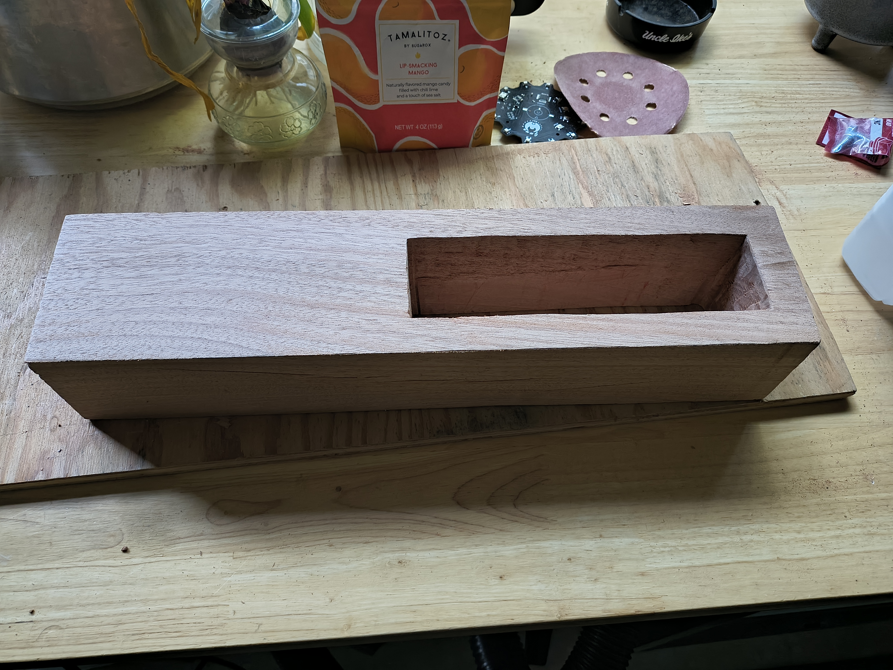
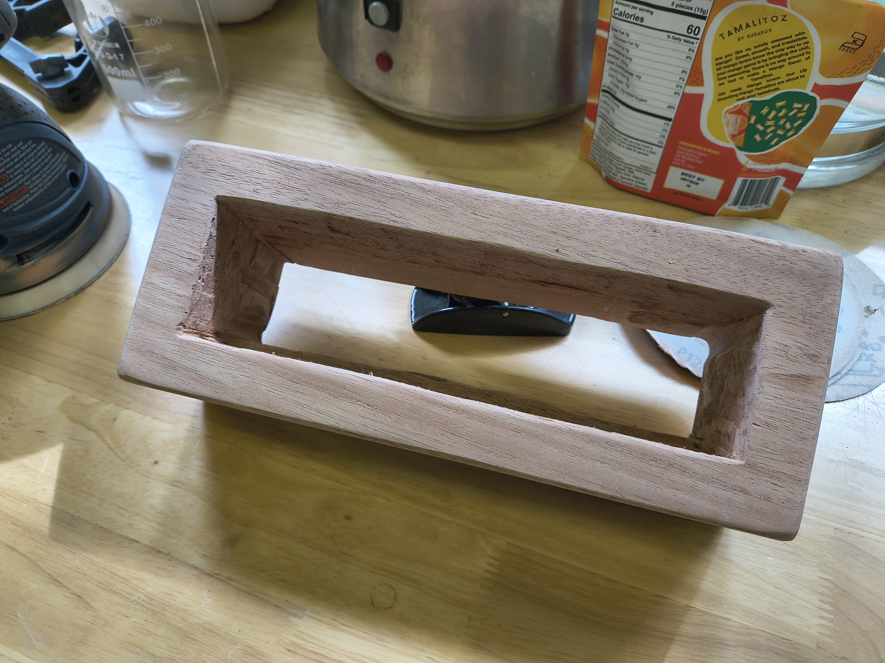
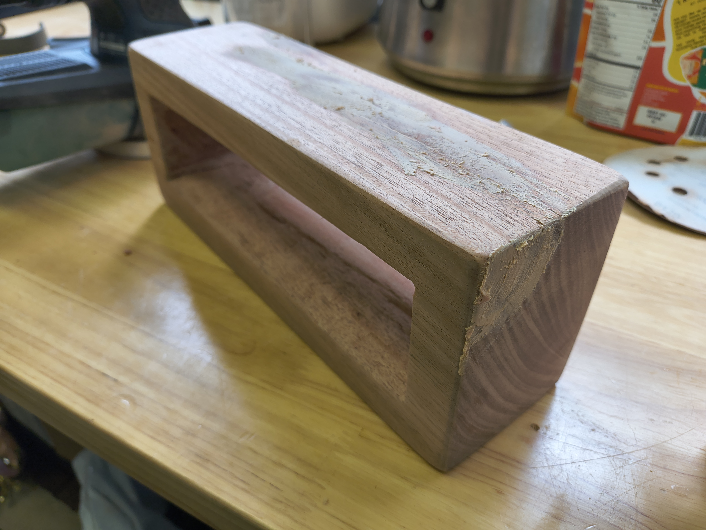
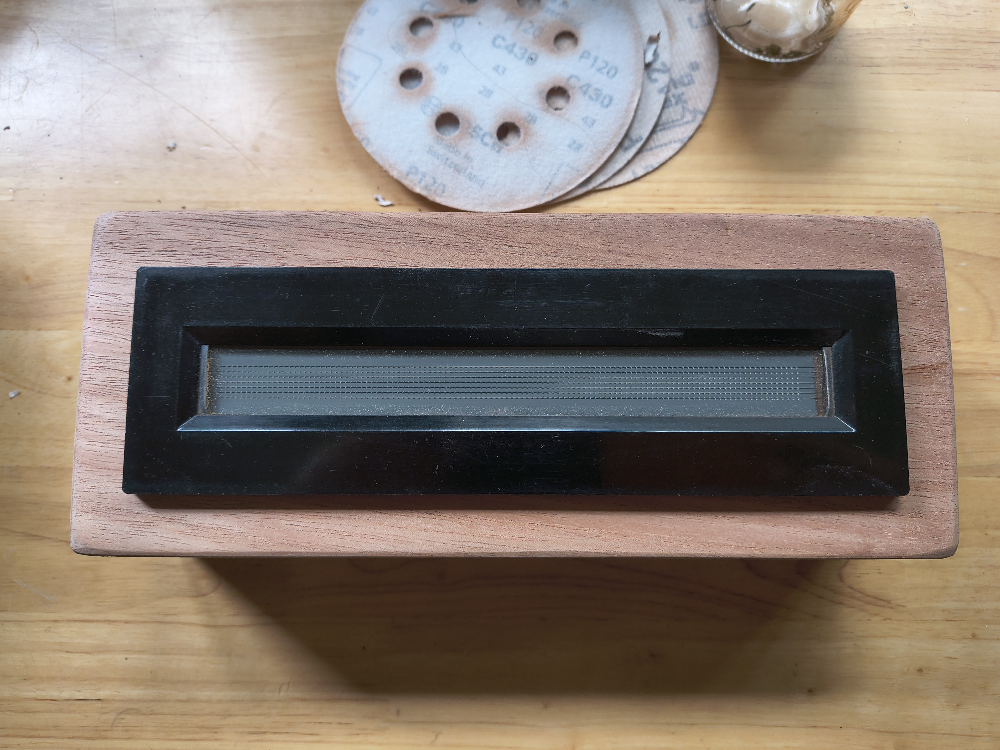
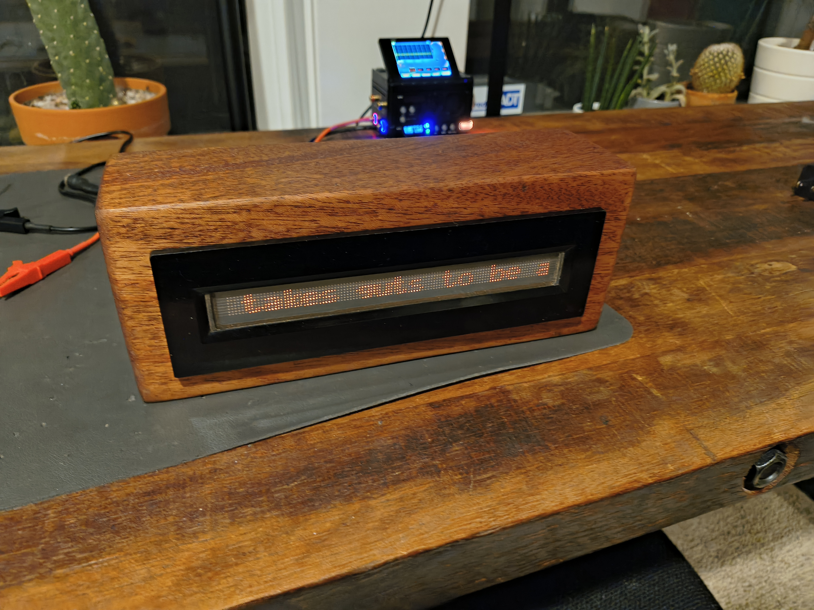
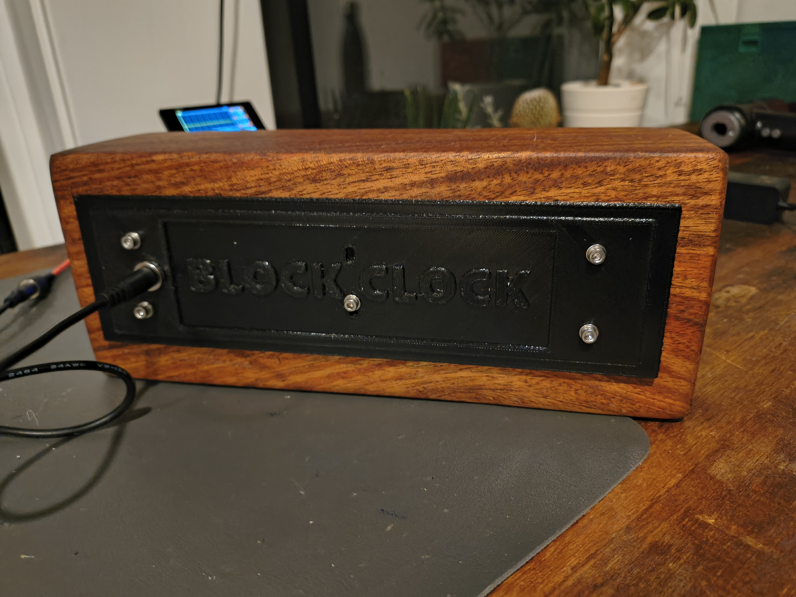

# Block Clock

A clock in block form. Although, it's not a clock. At least yet. But it's definitely a block. Perhaps I could call it Block Not Clock. It has a simple HTTP interface that messages are POSTed to by Home Assistant with an ample rotation of dad jokes and other strings that I would hopefully want to read.

The hardware and most of the firmware code is based on [Architeuthis-Flux](https://github.com/Architeuthis-Flux)'s [IGV1-16_Driver_Backpack](https://github.com/Architeuthis-Flux/IGV1-16_Driver_Backpack). Thank you to Kevin for sending me a couple prototype boards. Check out his much cooler product [Jumperless](https://github.com/Architeuthis-Flux/Jumperless)!

## Hardware

- [Raspberry Pi Pico W](https://www.raspberrypi.com/documentation/microcontrollers/pico-series.html)
- [IGV1-16 Driver Backpack](https://github.com/Architeuthis-Flux/IGV1-16_Driver_Backpack)
- [DC Boost Converter](https://www.aliexpress.us/item/3256805740935309.html)
- Finished Hardwood case (Danish oil)
- 3D printed PCB support and back plate
- M2/M3 hardware, DC panel mount jack

All components are stacked together: the PCB is mounted to the back of the GIPS-16-1 display using a 3D-printed support, secured with two bolts. The back plate attaches to the PCB support, holding the entire assembly inside the display case. The bezel/edges of the display and back plate clamp to the exterior of the case and hold everything firmly in place.

## Firmware

Based off of the firmware of the forked driver backpack project with some refactoring, code cleanup, and additions. One core handles updating the display buffer and handling REST API calls and the other core is dedicated to the display driver--i.e. controlling the scanning output to the matrix. Added support for OTA updates and a few other control settings.

## Future Improvements
- optimize firmware display buffer code - quick fixes seem to break smooth scrolling, so needs more investigation
- improve rigidity of PCB support panel - limited with case tightening since the PCB/support can flex too much
- smaller HV boost circuit - current one is too large for what's needed

## Images

#### Building Case

  
  

  
  

#### Fitting Stack in Case

  
  

  
  

#### Finished

  
  

